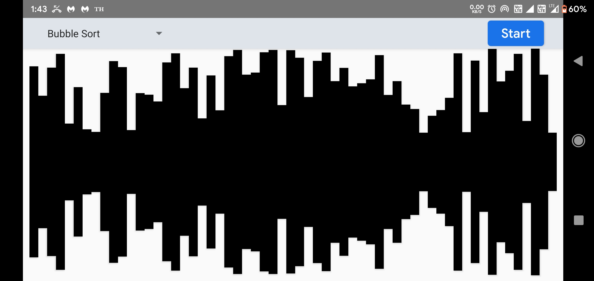
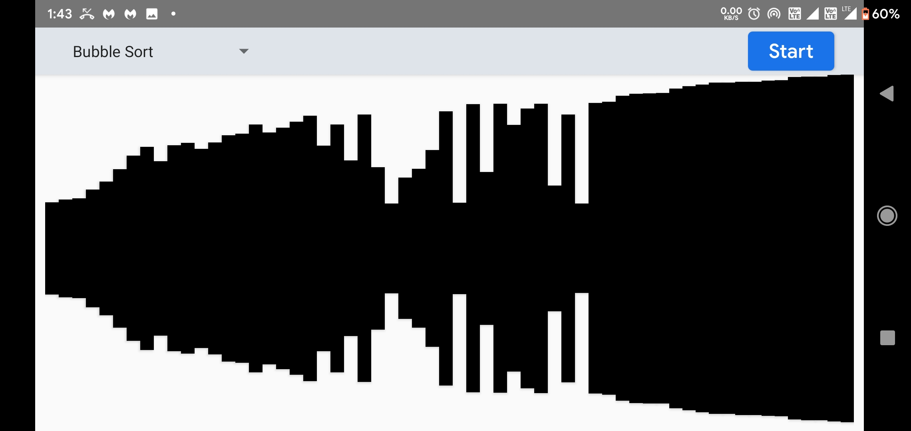
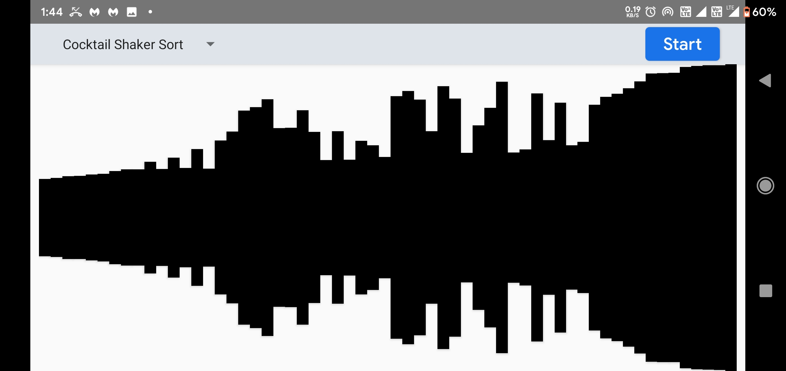
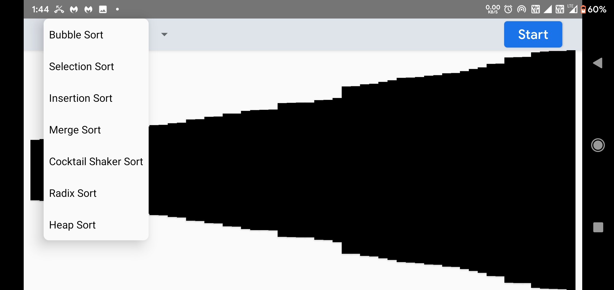
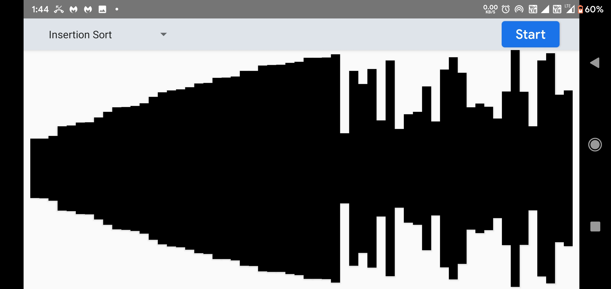

 

# Algorithm Visualizer

Algorithm Visualizer is an anroid alternative to visualize Algorithms on a 2D Screen. It is ad-free and and open source under MIT Lisence<br/>

<div style="display:flex;" >
<a href="https://play.google.com/store/apps/details?id=project.teamvoyager.visualizer">
    
</a>
<a href="https://play.google.com/store/apps/details?id=project.teamvoyager.visualizer">
    
</a>
</div>
</br></br>

## Screenshots
<div style="display:flex;" >






</div>

#### Contributing


###### Issues
You can trace the status of known issues [here](https://github.com/anandshivam44/Algorithm-Visualizer/issues),
also feel free to file a new issue (helpful description, screenshots and logcat are appreciated), or send me an [email](mailto:anand.shivam44@yahoo.com) if you have any questions.


#### Licensing
Algorithm Analyzer is licensed under the [MIT License](https://github.com/anandshivam44/Algorithm-Visualizer/blob/master/LICENSE).
In addition to the terms set by the MIT Lisence, we ask that if you use any code from this repository that you send us a message to let us know.
```shell
MIT License

Copyright (c) 2020 Shivam Anand

Permission is hereby granted, free of charge, to any person obtaining a copy
of this software and associated documentation files (the "Software"), to deal
in the Software without restriction, including without limitation the rights
to use, copy, modify, merge, publish, distribute, sublicense, and/or sell
copies of the Software, and to permit persons to whom the Software is
furnished to do so, subject to the following conditions:

The above copyright notice and this permission notice shall be included in all
copies or substantial portions of the Software.

THE SOFTWARE IS PROVIDED "AS IS", WITHOUT WARRANTY OF ANY KIND, EXPRESS OR
IMPLIED, INCLUDING BUT NOT LIMITED TO THE WARRANTIES OF MERCHANTABILITY,
FITNESS FOR A PARTICULAR PURPOSE AND NONINFRINGEMENT. IN NO EVENT SHALL THE
AUTHORS OR COPYRIGHT HOLDERS BE LIABLE FOR ANY CLAIM, DAMAGES OR OTHER
LIABILITY, WHETHER IN AN ACTION OF CONTRACT, TORT OR OTHERWISE, ARISING FROM,
OUT OF OR IN CONNECTION WITH THE SOFTWARE OR THE USE OR OTHER DEALINGS IN THE
SOFTWARE.
```
